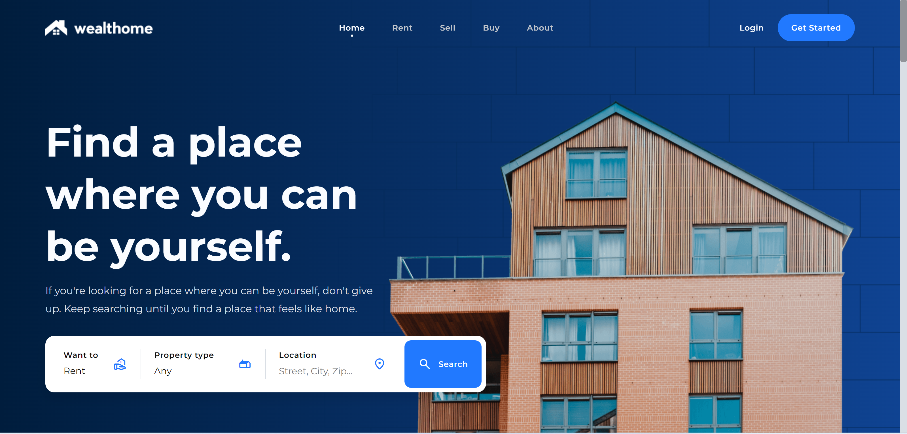
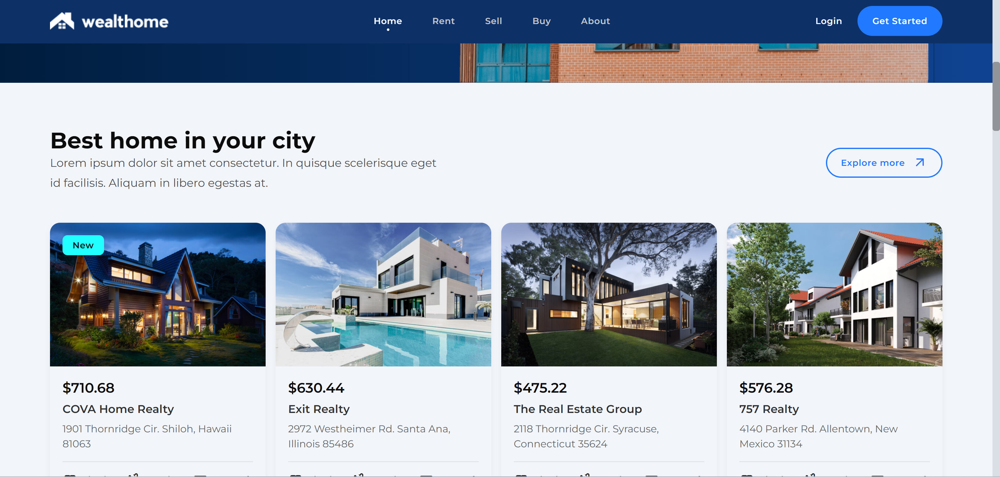
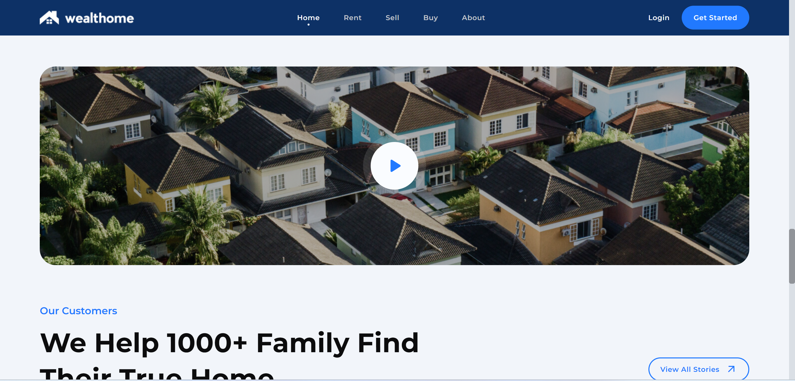

# Real_Estate_Website_Frontend

This is a frontend application designed for a real estate website where users can buy, sell, and rent properties. The website provides a user-friendly interface with various features to help users find their ideal home.





## Table of Contents

- Features
- Technologies Used
- Installation
- Usage

## Features

- **Responsive Design**: The website is fully responsive, ensuring a great user experience on devices of all sizes.
- **Property Search**: Users can search for properties based on type, location, and other filters.
- **Favorite Listings**: Users can mark properties as favorites for easy access later.
- **User Authentication**: Users can log in to their accounts to manage their listings and preferences.
- **Property Details**: Each listing includes detailed information about the property, including price, size, and amenities.

## Technologies Used

- HTML5
- CSS3
- JavaScript
- Tailwind CSS

## Installation

To get started with the project, follow these steps:

1. **Clone the repository**:
   ```bash
   git clone https://github.com/yourusername/wealthhome.git

2. **Navigate to the project directory**:
    ```bash
    cd wealthhome

3. **Open the index.html file in your browser**:
    ```bash
    open index.html  # or use your preferred method to open the HTML file

## Usage

- **Home Page**: Browse featured listings and access the main navigation.
- **Search Functionality**: Use the search bar to find properties based on your criteria.
- **Property Details**: Click on any listing to view detailed information and photos.
- **Favorites**: Save properties to your favorites by clicking the heart icon.


